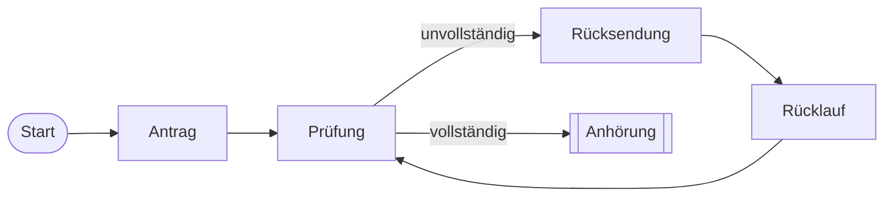

# Smart Contract PoC: Planfeststellungsverfahren (PlanApproval)


> **Begleit-Repository zum Fachartikel:** *"Smart Contracts im Planfeststellungsverfahren: Ansätze für eine rechtssichere und effiziente Verfahrensstruktur"

## 📄 Über dieses Projekt

Dieses Repository enthält den **Proof of Concept (PoC)** für die Implementierung deutscher Verwaltungsverfahrens-Logik auf der Ethereum Virtual Machine (EVM).

Ziel ist es, die abstrakten rechtlichen Anforderungen des **Verwaltungsverfahrensgesetzes (VwVfG)** – insbesondere im Kontext komplexer Planfeststellungsverfahren (§ 73 VwVfG) – in deterministischen, unveränderbaren Code zu übersetzen. Der Fokus liegt auf Transparenz, Fristenwahrung und Revisionssicherheit.

---

## ⚖️ Legal Engineering: Vom Gesetz zum Code

Die Kerninnovation liegt in der direkten Abbildung juristischer Normen in technische Logik-Gatter. Die folgende Tabelle zeigt das Mapping zwischen VwVfG und Smart Contract Architektur:

| Juristische Anforderung | Rechtsgrundlage (DE) | Technische Implementierung (Solidity) |
| :--- | :--- | :--- |
| **Präklusion / Fristen** | § 73 Abs. 4 VwVfG | `modifier onlyBeforeDeadline()` <br> *Sperrt Schreibzugriffe nach Ablauf des Unix-Timestamps.* |
| **Schriftformersatz** | § 3a Abs. 2 VwVfG | `function submitObjection(string memory _hash)` <br> *Verarbeitet den kryptographischen Hash des Dokuments.* |
| **Bekanntmachung** | § 73 Abs. 5 VwVfG | `event ObjectionRegistered(address indexed sender, ...)` <br> *Erzeugt einen öffentlichen, unveränderbaren Log-Eintrag.* |
| **Unveränderbarkeit** | Rechtsstaatsprinzip | `mapping(bytes32 => Objection) private objections` <br> *Keine Update-Funktion für bereits geschriebene Daten.* |

---

## 🛠 Technische Architektur (State Machine)

Aus ingenieurwissenschaftlicher Sicht wird das Verwaltungsverfahren als **Endlicher Automat (Finite State Machine)** modelliert. Der Smart Contract erlaubt Zustandsübergänge nur, wenn definierte Vorbedingungen erfüllt sind.
### Prozess-Logik (State Machine)
```mermaid
## Prozess-Logik (State Machine)

Das ist der allgemeine Ablauf:

```mermaid
flowchart LR
    A([Start]) --> B[Antrag]
    B --> C[Prüfung]
    C -->|unvollständig| D[Rücksendung]
    D --> E[Rücklauf]
    E --> C
    C -->|vollständig| F[[Anhörung]]
```

Und hier ist das Detail-Verfahren für Planänderungen:

## Prozess-Logik (State Machine)

Das ist der allgemeine Ablauf:



Und hier ist das Detail-Verfahren für Planänderungen (§ 76 VwVfG):

```mermaid
flowchart TD
    %% Styling
    classDef start fill:#2563eb,stroke:#1d4ed8,color:white,font-weight:bold;
    classDef stop fill:#dc2626,stroke:#b91c1c,color:white;
    classDef process fill:#eff6ff,stroke:#3b82f6,color:black;
    classDef decision fill:#fff7ed,stroke:#f97316,color:black;
    classDef blockchain fill:#f3e8ff,stroke:#7e22ce,color:black,stroke-dasharray: 5 5;

    Start([Antrag auf Planänderung<br/>§ 76 Abs. 1 VwVfG]):::start --> IdentCheck{Identität des<br/>Vorhabens gewahrt?}:::decision

    IdentCheck -- Nein --> Neubau[Aufhebung & Neubeginn<br/>§ 77 VwVfG]:::stop
    IdentCheck -- Ja --> UVPCheck{UVP-Pflicht oder<br/>wesentliche Bedeutung?<br/>Abs. 4}:::decision

    UVPCheck -- Ja --> NeuesVerfahren[Neues PF-Verfahren<br/>§ 76 Abs. 1]:::process
    NeuesVerfahren --> Eroerterung(Verzicht auf Erörterungstermin möglich<br/>§ 18d AEG)

    UVPCheck -- Nein --> Unwesentlich[Unwesentliche Bedeutung<br/>§ 76 Abs. 2 VwVfG]:::process
    Unwesentlich --> BetroffenCheck{Alle Betroffenen<br/>zugestimmt?}:::decision

    BetroffenCheck -- Ja --> Direct[Genehmigung ohne Verfahren<br/>EBA entscheidet direkt]:::process
    BetroffenCheck -- Nein --> Anhoerung[Verfahren ohne Anhörung<br/>aber mit Beteiligung § 28 VwVfG]:::process

    %% Blockchain Integration Visualisierung
    subgraph BC [Blockchain Layer - Versioning]
        B1[Block #101: Ursprungsplan]:::blockchain -.-> B2[Block #205: Planänderung]:::blockchain
        B2 -.-> B3[Smart Contract: Merged View]:::blockchain
    end

    Direct -.-> B2
    Anhoerung -.-> B2
    NeuesVerfahren -.-> B2
```mermaid

## 🚀 Quick Start (Keine Installation nötig)

Um den Smart Contract und die Logik ohne lokale Entwicklungsumgebung zu testen, kann der Code direkt in der Web-IDE **Remix** ausgeführt werden.

1. **[Klicken Sie hier, um den Code in Remix zu öffnen](https://remix.ethereum.org)** (Copy-Paste des Codes aus `/contracts/PlanApproval.sol`).
2. Kompilieren Sie den Contract (Tab "Solidity Compiler").
3. Gehen Sie auf "Deploy & Run Transactions".
4. Wählen Sie als Environment "Remix VM (Cancun)".
5. Deployen Sie den Contract und testen Sie die Funktionen `submitObjection` etc.

---

## 📂 Repository Struktur

```text
/plan-approval-logic
├── contracts/
│   └── PlanApproval.sol       # Der Haupt-Vertrags-Code (Solidity)
├── tests/
│   └── PlanApproval.test.js   # Unit Tests zur Verifizierung der Fristenlogik
├── docs/                      # Zusätzliche Dokumentation & Diagramme
└── README.md                  # Diese Datei
