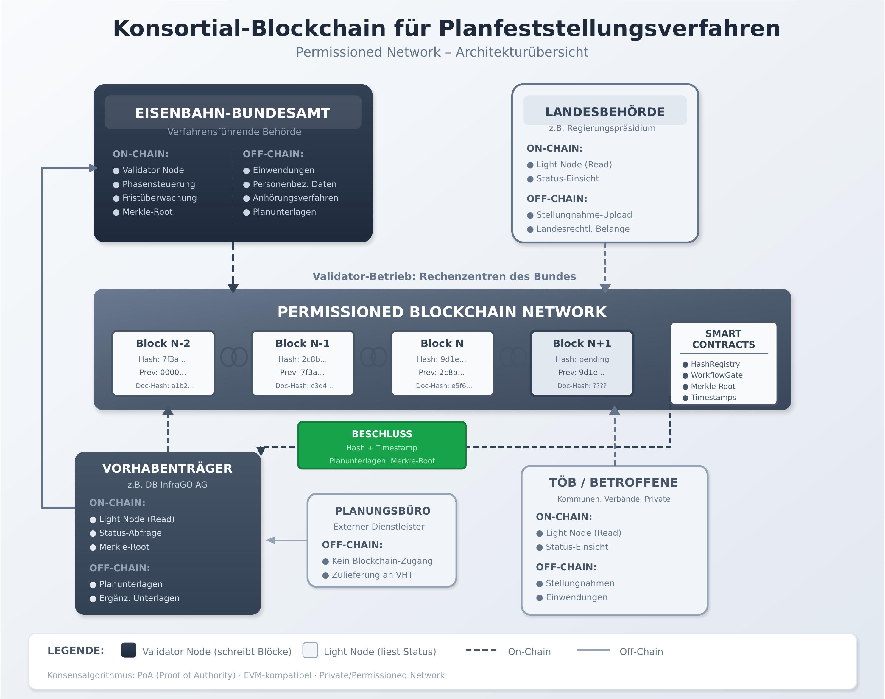

# Blockchain in der Planfeststellung: Technische Dokumentation

**Begleitdokumentation zum ETR-Artikel (Ausgabe 5/2026)**

---

## Inhaltsverzeichnis

1. [Überblick](#überblick)
2. [Architekturprinzipien](#architekturprinzipien)
3. [Smart Contract Design](#smart-contract-design)
4. [Verfahrensablauf](#verfahrensablauf)
5. [Implementierungsdetails](#implementierungsdetails)
6. [Sicherheit und Datenschutz](#sicherheit-und-datenschutz)
7. [Deployment-Szenarien](#deployment-szenarien)

---

## Überblick

### Motivation

Planfeststellungsverfahren im Eisenbahnwesen sind durch ihre Komplexität und lange Verfahrensdauer gekennzeichnet. Die Blockchain-Technologie bietet Potenzial zur Verbesserung der:
- **Nachvollziehbarkeit** aller Verfahrensschritte
- **Transparenz** gegenüber allen Beteiligten
- **Prozessdisziplin** durch automatisierte Gates
- **Rechtssicherheit** durch unveränderbare Audit-Trails

### Abgrenzung

**Was Blockchain KANN:**
- Dokumentenversionen fälschungssicher verankern (Hash-Registry)
- Verfahrensschritte automatisiert kontrollieren (Workflow-Gates)
- Lückenlose Protokollierung aller Aktionen (Event-Trail)

**Was Blockchain NICHT KANN:**
- Juristische Abwägungen ersetzen
- Hoheitliche Entscheidungen automatisieren
- Komplexität des Verfahrens grundsätzlich reduzieren

### Rechtlicher Rahmen

- § 18 Allgemeines Eisenbahngesetz (AEG)
- § 76 Verwaltungsverfahrensgesetz (VwVfG)
- § 3a VwVfG (E-Government)
- § 371a ZPO (Beweiswert elektronischer Dokumente)
- Art. 5, 17 DSGVO (Datenschutz)

---

## Architekturprinzipien

### 1. Off-Chain / On-Chain Trennung

```
┌────────────────────────────────────────┐
│  OFF-CHAIN (Daten & Arbeitsprozesse)   │
│  --------------------------------------│
│  • E-Akte / DMS (Doweba)               │
│  • Antrags- und Beteiligungsportal     │
│  • Personenbezogene Daten              │
│  • Originaldokumente (PDF, CAD)        │
│  • Fachverfahren (GIS, BIM)            │
└──────────────┬─────────────────────────┘
               │
               │ 
               │ 
               │
┌──────────────▼─────────────────────────┐
│  ON-CHAIN (Beweise & Kontrolle)        │
│  --------------------------------------│
│  • Hash-Registry (Dokumentversionen)   │
│  • Smart Contracts (Workflow-Logik)    │
│  • Event-Log (Audit-Trail)             │
│  • Rollenverwaltung (Access Control)   │
└────────────────────────────────────────┘
```

**Datenschutz-Design:**
- On-Chain: AUSSCHLIESSLICH Hashes (32 Bytes), IDs, Zeitstempel
- Off-Chain: ALLE Inhalte, personenbezogene Daten, Fachdaten

### 2. Permissioned Consortium Network

**Netzwerk-Topologie:**



**Konsens:** PoA (Proof of Authority) · EVM-kompatibel · Private/Permissioned Network


### 3. Legal Engineering Mapping

Juristische Anforderungen werden direkt in Code-Logik übersetzt:

| Rechtliche Anforderung | Rechtsgrundlage | Technische Implementierung |
|------------------------|-----------------|----------------------------|
| Präklusion / Fristen | § 73 Abs. 4 VwVfG | `modifier onlyBeforeDeadline()` |
| Schriftformersatz | § 3a Abs. 2 VwVfG | `function submitObjection(bytes32 _hash)` |
| Bekanntmachung | § 73 Abs. 5 VwVfG | `event ObjectionRegistered(...)` |
| Unveränderbarkeit | Rechtsstaatsprinzip | `mapping(bytes32 => Objection) private objections` |

---

## Smart Contract Design

### State Machine: Verfahrensphasen

```solidity
enum Status {
    Einreichung,        // 0: Antrag eingereicht
    Vollstaendigkeit,   // 1: Vollständigkeitsprüfung
    Auslegung,          // 2: Öffentliche Auslegung + TÖB
    Abwaegung,          // 3: Abwägung der Einwendungen
    BeschlussEntwurf,   // 4: Beschlussentwurf intern
    Beschluss,          // 5: Planfeststellungsbeschluss
    Rechtskraft         // 6: Beschluss rechtskräftig
}
```

### Workflow-Gates

Jeder Phasenwechsel ist an definierte Bedingungen geknüpft:

#### Gate 1: Einreichung → Vollständigkeit
```solidity
function _checkGate_Vollstaendigkeit(bytes32 _dossierId) internal view {
    Verfahren memory v = verfahren[_dossierId];
    
    // Pflicht: Merkle-Root gesetzt
    require(v.merkleRoot != bytes32(0), "Planunterlagen fehlen");
    
    // Pflicht: Vorhabenträger identifiziert
    require(v.vorhabentraeger != address(0), "Vorhabentraeger ungueltig");
}
```

#### Gate 2: Vollständigkeit → Auslegung
```solidity
function _checkGate_Auslegung(bytes32 _dossierId) internal view {
    Verfahren memory v = verfahren[_dossierId];
    
    // Pflicht: Vollständigkeit bestätigt
    require(v.vollstaendigkeitBestaetigt, "Vollstaendigkeit nicht bestaetigt");
    
    // Pflicht: Auslegungsfrist gesetzt
    require(v.auslegungsfrist > block.timestamp, "Auslegungsfrist ungueltig");
}
```

#### Gate 3: Auslegung → Abwägung
```solidity
function _checkGate_Abwaegung(bytes32 _dossierId) internal view {
    Verfahren memory v = verfahren[_dossierId];
    
    // Pflicht: Auslegungsfrist abgelaufen
    require(block.timestamp > v.auslegungsfrist, "Auslegungsfrist laeuft noch");
    
    // Pflicht: TÖB-Beteiligung abgeschlossen
    require(v.toebBeteiligt, "TOEB-Beteiligung nicht abgeschlossen");
}
```

#### Gate 4: Abwägung → Beschlussentwurf
```solidity
function _checkGate_Beschluss(bytes32 _dossierId) internal view {
    Verfahren memory v = verfahren[_dossierId];
    
    // Pflicht: Alle Einwendungen bearbeitet
    require(v.offeneEinwendungen == 0, "Noch offene Einwendungen");
}
```

### Event-Trail

```solidity
event Fortschritt(
    bytes32 indexed dossierId,
    Status von,
    Status nach,
    uint256 zeitstempel,
    address initiator
);

event DokumentVerankert(
    bytes32 indexed dossierId,
    bytes32 indexed dokumentId,
    bytes32 hash,
    uint256 zeitstempel
);

event EinwendungEingereicht(
    bytes32 indexed dossierId,
    bytes32 indexed einwendungsId,
    address einwender,
    uint256 zeitstempel,
    bool fristgerecht
);
```

---

## Verfahrensablauf

### Beispiel: Vollständiger Durchlauf

```solidity
// 1. EINREICHUNG (Vorhabenträger)
bytes32 dossierId = keccak256("PF_2026_042_ABS_Hamburg_Hannover");
bytes32 merkleRoot = calculateMerkleRoot(planunterlagen);
workflow.verfahrenEinreichen(dossierId, merkleRoot);

// 2. VOLLSTÄNDIGKEITSPRÜFUNG (Sachbereich 1 PF)
workflow.vollstaendigkeitPruefen(dossierId, true);
// → Status wechselt zu "Vollstaendigkeit"

// 3. AUSLEGUNG STARTEN (Sachbereich 1 PF)
uint256 fristEnde = block.timestamp + 30 days;
workflow.auslegungStarten(dossierId, fristEnde);
// → Status wechselt zu "Auslegung"
// → Portal öffnet sich für Einwendungen

// 4. EINWENDUNGEN (Öffentlichkeit)
bytes32 einwendungsHash = keccak256(abi.encodePacked(einwendungstext));
workflow.einwendungEinreichen(dossierId, einwendungsHash);
// → Event: EinwendungEingereicht

// 5. ABWÄGUNG (nach Fristablauf)
workflow.abwaegungAbschliessen(dossierId);
// → Status wechselt zu "Abwaegung"

// 6. BESCHLUSS (Sachbereich 1 PF)
bytes32 beschlussHash = keccak256(abi.encodePacked(beschlussdokument));
workflow.beschlussErstellen(dossierId, beschlussHash);
// → Status wechselt zu "Beschluss"

// 7. RECHTSKRAFT (nach Ablauf Klagefrist)
workflow.rechtskraftFeststellen(dossierId);
// → Status wechselt zu "Rechtskraft"
```

---

## Implementierungsdetails

### Merkle-Bäume für Dokumentenpakete

**Problem:** Planfeststellungsverfahren umfassen hunderte bis tausende Dokumente (Pläne, Gutachten, Stellungnahmen).

**Lösung:** Merkle-Baum verdichtet alle Dokumente zu einem einzigen 32-Byte-Hash:

```
         Root-Hash (on-chain)
           /        \
        H(AB)      H(CD)
        /  \        /  \
      H(A) H(B)  H(C) H(D)
       |    |     |    |
     Doc1 Doc2 Doc3 Doc4
    (off-chain)
```

**Implementierung:**
```solidity
function calculateMerkleRoot(bytes32[] memory dokumentHashes) 
    public 
    pure 
    returns (bytes32) 
{
    uint256 n = dokumentHashes.length;
    require(n > 0, "Keine Dokumente");
    
    while (n > 1) {
        for (uint256 i = 0; i < n / 2; i++) {
            dokumentHashes[i] = keccak256(
                abi.encodePacked(
                    dokumentHashes[2 * i],
                    dokumentHashes[2 * i + 1]
                )
            );
        }
        if (n % 2 == 1) {
            dokumentHashes[n / 2] = dokumentHashes[n - 1];
            n = n / 2 + 1;
        } else {
            n = n / 2;
        }
    }
    return dokumentHashes[0];
}
```

### Einwendungsmanagement

```solidity
struct Einwendung {
    bytes32 einwendungsId;
    bytes32 dossierId;
    address einwender;
    bytes32 dokumentHash;       // Hash der Einwendung (off-chain)
    uint256 eingangsDatum;
    bool fristgerecht;
    bool bearbeitet;
}

function einwendungEinreichen(bytes32 _dossierId, bytes32 _dokumentHash) 
    external 
    verfahrenExistiert(_dossierId) 
{
    Verfahren storage v = verfahren[_dossierId];
    require(v.status == Status.Auslegung, "Keine Auslegungsphase");
    
    bool fristgerecht = block.timestamp <= v.auslegungsfrist;
    
    bytes32 einwendungsId = keccak256(
        abi.encodePacked(_dossierId, msg.sender, block.timestamp)
    );
    
    Einwendung memory neueEinwendung = Einwendung({
        einwendungsId: einwendungsId,
        dossierId: _dossierId,
        einwender: msg.sender,
        dokumentHash: _dokumentHash,
        eingangsDatum: block.timestamp,
        fristgerecht: fristgerecht,
        bearbeitet: false
    });
    
    einwendungen[einwendungsId] = neueEinwendung;
    verfahrenEinwendungen[_dossierId].push(einwendungsId);
    
    if (fristgerecht) {
        v.anzahlEinwendungen++;
        v.offeneEinwendungen++;
    }
    
    emit EinwendungEingereicht(
        _dossierId,
        einwendungsId,
        msg.sender,
        block.timestamp,
        fristgerecht
    );
}
```

---

## Sicherheit und Datenschutz

### DSGVO-Konformität

**Art. 5 Abs. 1 lit. e DSGVO (Speicherbegrenzung):**
- ✅ Gelöst durch Off-Chain-Speicherung aller personenbezogenen Daten
- ✅ On-Chain nur anonyme Hashes

**Art. 17 DSGVO (Recht auf Löschung):**
- ✅ Personenbezogene Daten verbleiben off-chain und können gelöscht werden
- ✅ On-Chain-Hashes enthalten keine Rückschlüsse auf Personen

### Access Control

```solidity
modifier nurRolle(Role _rolle) {
    require(rollen[msg.sender] == _rolle, "Unzureichende Berechtigung");
    _;
}

modifier nurSachbereich1PF() {
    require(
        rollen[msg.sender] == Role.Sachbereich1PF,
        "Nur Sachbereich 1 PF"
    );
    _;
}
```

### Übersteuerung (Override Mechanism)

**Problem:** Automatisierte Gates könnten in Ausnahmefällen den Verfahrensfortschritt blockieren (z.B. wenn Fiktionswirkung § 73 Abs. 3a VwVfG greift).

**Lösung:** Kontrollierte Übersteuerung mit Begründungspflicht:

```solidity
event GateOverride(
    bytes32 indexed dossierId,
    Status von,
    Status nach,
    string begruendung,
    address initiator,
    uint256 zeitstempel
);

function overrideGate(
    bytes32 _dossierId, 
    Status _neuerStatus, 
    string memory _begruendung
) 
    external 
    nurSachbereich1PF 
{
    require(bytes(_begruendung).length > 20, "Begruendung zu kurz");
    
    Verfahren storage v = verfahren[_dossierId];
    Status alterStatus = v.status;
    v.status = _neuerStatus;
    
    emit GateOverride(
        _dossierId,
        alterStatus,
        _neuerStatus,
        _begruendung,
        msg.sender,
        block.timestamp
    );
}
```

---

## Deployment-Szenarien

### Szenario 1: Pilot (Shadow-Run)

**Setup:** Blockchain läuft parallel zum bestehenden Verfahren
**Zweck:** Validierung, KPI-Messung, Lessons Learned
**Dauer:** 6-12 Monate

### Szenario 2: Produktiv (Selected Procedures)

**Setup:** Blockchain ist verbindlich für ausgewählte Verfahrensschritte
**Zweck:** Schrittweise Integration
**Beispiel:** Nur Einwendungsmanagement + Fristenkontrolle

### Szenario 3: Vollintegration

**Setup:** Komplettes Verfahren läuft über Blockchain
**Zweck:** Maximale Transparenz und Effizienz
**Voraussetzung:** Erfolgreiche Pilotierung

---

**Autor:** Klaus Walter  
**Version:** 1.0  
**Stand:** Januar 2026  
**Lizenz:** MIT
